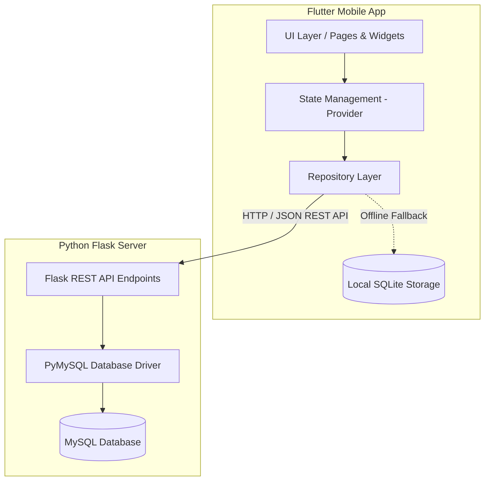

# Documentation & Knowledge Base: Tiptronic E-Commerce System
**Sistem Aplikasi Toko Elektronik Full-Stack (Flutter Mobile & Flask REST API MySQL)**

---

## 1. Ikhtisar Sistem (System Overview)

**Tiptronic** adalah sistem e-commerce toko elektronik end-to-end yang mengintegrasikan aplikasi mobile lintas platform berbasis **Flutter** (Android/iOS) dengan backend RESTful API berbasis **Python Flask** dan basis data **MySQL**. Sistem ini dirancang untuk menangani seluruh siklus transaksi e-commerce, mulai dari manajemen katalog produk, autentikasi multi-peran (Admin & Pelanggan), keranjang belanja, wishlist, kalkulasi ongkos kirim berbasis lokasi GPS & peta interaktif, transaksi pembayaran, hingga manajemen pengiriman resi dan laporan penjualan admin.

### Key Highlights
- **Multi-Role System**: Memisahkan antarmuka & hak akses antara **Pelanggan (User)** dan **Manajer Toko (Admin)**.
- **Dual-Database & Offline Capability**: Mendukung sinkronisasi data online melalui Flask REST API ke MySQL dan *fallback storage* lokal menggunakan SQLite di sisi Flutter.
- **Advanced Filtering & Sorting**: Fitur pencarian kata kunci, filter kategori, rentang harga min-max, dan pengurutan harga/terbaru.
- **Location-Based Shipping**: Kalkulasi estimasi ongkos kirim otomatis berdasarkan koordinat GPS perangkat (*Geolocator*) dan pemilih peta lokasi interaktif (*Map Picker*).
- **Responsive & Modern UI**: Desain antarmuka berstandar e-commerce modern dengan *Dark Mode*, *Micro-animations*, *Badge Status*, serta tata letak responsif bebas overflow.

---

## 2. Arsitektur & Teknologi (Architecture & Tech Stack)



### Tech Stack Matrix
| Layer | Komponen / Teknologi | Keterangan |
|---|---|---|
| **Frontend Mobile** | Flutter 3.x, Dart | Framework Cross-Platform Mobile App |
| **State Management** | Provider | Mengelola state aplikasi secara terpusat & reaktif |
| **Local Database** | SQLite (`sqflite`) | Penyimpanan lokal untuk keranjang & cache produk offline |
| **Backend Server** | Python 3.x, Flask, Flask-CORS | Server REST API modular & ringan |
| **Database Remote** | MySQL (Database Name: `toko_elektronik_db`) | Database relational terpusat |
| **Integrasi Lokasi** | Geolocator & Flutter Map / Geocoding | Deteksi koordinat lokasi GPS real-time & kalkulasi jarak |
| **Image Caching** | `cached_network_image` | Optimasi pemuatan gambar produk & banner promo |

---

## 3. Skema Basis Data MySQL (Database Schema)

Basis data MySQL yang digunakan bernama `toko_elektronik_db`. Berikut adalah tabel-tabel utama beserta struktur kolom dan relasinya:

### 1. Tabel `users`
Menyimpan data akun pengguna (Admin dan Pelanggan).
- `id` (INT, Primary Key, Auto Increment)
- `name` (VARCHAR 100, NOT NULL)
- `email` (VARCHAR 100, UNIQUE, NOT NULL)
- `password` (VARCHAR 255, NOT NULL)
- `role` (VARCHAR 20, DEFAULT `'user'`) — Nilai: `'user'` atau `'admin'`
- `created_at` (TIMESTAMP, DEFAULT CURRENT_TIMESTAMP)

### 2. Tabel `products`
Menyimpan data katalog produk elektronik.
- `id` (INT, Primary Key, Auto Increment)
- `name` (VARCHAR 255, NOT NULL)
- `description` (TEXT)
- `price` (DECIMAL 12,2, DEFAULT 0.00)
- `stock` (INT, DEFAULT 0)
- `image` (TEXT) — URL gambar produk
- `category` (VARCHAR 100) — Contoh: `laptops`, `smartphones`, `audio`, `tv`
- `created_at` (TIMESTAMP, DEFAULT CURRENT_TIMESTAMP)

### 3. Tabel `cart`
Menyimpan item produk dalam keranjang belanja.
- `id` (INT, Primary Key, Auto Increment)
- `productId` (INT, Foreign Key -> `products.id` ON DELETE CASCADE)
- `quantity` (INT, DEFAULT 1)
- `created_at` (TIMESTAMP, DEFAULT CURRENT_TIMESTAMP)

### 4. Tabel `wishlist`
Menyimpan daftar produk favorit pengguna.
- `id` (INT, Primary Key, Auto Increment)
- `userId` (INT, NOT NULL)
- `productId` (INT, NOT NULL)
- `created_at` (TIMESTAMP, DEFAULT CURRENT_TIMESTAMP)

### 5. Tabel `reviews`
Menyimpan ulasan dan rating produk dari pengguna.
- `id` (INT, Primary Key, Auto Increment)
- `userId` (INT, NOT NULL)
- `userName` (VARCHAR 100, NOT NULL)
- `productId` (INT, NOT NULL)
- `transactionId` (INT, NULLABLE)
- `rating` (INT, DEFAULT 5) — Skala 1 - 5
- `comment` (TEXT)
- `created_at` (TIMESTAMP, DEFAULT CURRENT_TIMESTAMP)

### 6. Tabel `banners`
Menyimpan banner promosi di halaman utama.
- `id` (INT, Primary Key, Auto Increment)
- `title` (VARCHAR 255, NOT NULL)
- `subtitle` (VARCHAR 255)
- `image` (TEXT, NOT NULL)
- `is_active` (BOOLEAN, DEFAULT TRUE)
- `created_at` (TIMESTAMP, DEFAULT CURRENT_TIMESTAMP)

### 7. Tabel `transactions`
Menyimpan data header pesanan/transaksi.
- `id` (INT, Primary Key, Auto Increment)
- `invoice` (VARCHAR 100, NOT NULL) — Format: `INV-YYYYMMDD-XXXX`
- `userId` (INT, Foreign Key -> `users.id` ON DELETE CASCADE)
- `total` (DECIMAL 12,2, DEFAULT 0.00) — Total belanja + ongkir
- `shippingFee` (DECIMAL 12,2, DEFAULT 0.00)
- `address` (TEXT) — Alamat pengiriman & koordinat GPS
- `status` (VARCHAR 50, DEFAULT `'Menunggu Konfirmasi'`) — Status: `Menunggu Konfirmasi`, `Diproses`, `Dikirim`, `Selesai`
- `date` (VARCHAR 100) — Tanggal transaksi
- `paymentMethod` (VARCHAR 100) — Contoh: `Transfer Bank BCA / Mandiri`, `QRIS All Payment`, `COD`
- `courier` (VARCHAR 100) — Contoh: `JNE Regular`, `J&T Express`, `Pos Indonesia`
- `trackingNumber` (VARCHAR 100) — Nomor Resi Pengiriman
- `created_at` (TIMESTAMP, DEFAULT CURRENT_TIMESTAMP)

### 8. Tabel `transaction_items`
Menyimpan rincian item dalam setiap transaksi.
- `id` (INT, Primary Key, Auto Increment)
- `transactionId` (INT, Foreign Key -> `transactions.id` ON DELETE CASCADE)
- `productId` (INT, Foreign Key -> `products.id` ON DELETE CASCADE)
- `quantity` (INT, DEFAULT 1)
- `price` (DECIMAL 12,2, DEFAULT 0.00)

---

## 4. Dokumentasi API Backend (Flask REST API)

Server berjalan di `http://localhost:5000` (atau IP server lokal). Semua respons dikembalikan dalam format JSON.

### Endpoints Autentikasi & Pengguna (`/api/users`)
- `POST /api/register`
  - Body: `{"name": "...", "email": "...", "password": "...", "role": "user"}`
  - Output: Mengembalikan data akun pengguna baru.
- `POST /api/login`
  - Body: `{"email": "...", "password": "..."}`
  - Output: Mengembalikan data pengguna beserta peran (`role`).
- `GET /api/users/<user_id>`
  - Output: Mengambil profil pengguna.
- `PUT /api/users/<user_id>`
  - Body: `{"name": "...", "email": "..."}`
  - Output: Memperbarui nama dan email pengguna.
- `PUT /api/users/<user_id>/password`
  - Body: `{"oldPassword": "...", "newPassword": "..."}`
  - Output: Memperbarui kata sandi akun.
- `GET /api/users/count`
  - Output: Total pengguna terdaftar (khusus Admin Dashboard).

### Endpoints Produk (`/api/products`)
- `GET /api/products`
  - Query Params Options:
    - `category`: Filter berdasarkan kategori (`laptops`, `smartphones`, `audio`, `tv`).
    - `search`: Pencarian nama/deskripsi produk.
    - `minPrice` & `maxPrice`: Filter harga minimum dan maksimum.
    - `sort`: Pengurutan (`latest`, `price_asc`, `price_desc`).
- `GET /api/products/<product_id>`
  - Output: Detail produk tunggal.
- `POST /api/products` *(Admin)*
  - Body: `{"name": "...", "description": "...", "price": 0, "stock": 0, "image": "...", "category": "..."}`
- `PUT /api/products/<product_id>` *(Admin)*
  - Body: Data pembaruan produk.
- `DELETE /api/products/<product_id>` *(Admin)*
  - Output: Menghapus produk dari database.

### Endpoints Keranjang & Wishlist (`/api/cart` & `/api/wishlist`)
- `GET /api/cart` — Mengambil seluruh item keranjang.
- `POST /api/cart` — Menambah item ke keranjang (`productId`, `quantity`).
- `PUT /api/cart/<cart_id>` — Mengubah kuantitas produk di keranjang.
- `DELETE /api/cart/<cart_id>` — Menghapus item dari keranjang.
- `GET /api/wishlist/<user_id>` — Mengambil daftar wishlist pengguna.
- `POST /api/wishlist` — Menambah produk ke wishlist.
- `DELETE /api/wishlist/<user_id>/<product_id>` — Menghapus produk dari wishlist.

### Endpoints Transaksi & Pesanan (`/api/transactions`)
- `POST /api/transactions`
  - Body: Data checkout (`userId`, `total`, `shippingFee`, `address`, `paymentMethod`, `courier`, `items`).
  - Efek: Membuat baris transaksi baru, mengisi `transaction_items`, dan mengosongkan keranjang.
- `GET /api/transactions/user/<user_id>` — Riwayat transaksi milik pelanggan tertentu.
- `GET /api/transactions` *(Admin)* — Daftar seluruh transaksi sistem.
- `PUT /api/transactions/<id>/status` *(Admin)*
  - Body: `{"status": "Diproses" | "Dikirim" | "Selesai"}`
  - Efek: Saat status menjadi `'Selesai'`, stok produk akan otomatis dikurangi secara otomatis di database.
- `PUT /api/transactions/<id>/tracking` *(Admin)*
  - Body: `{"courier": "...", "trackingNumber": "..."}`
  - Efek: Memperbarui nomor resi pengiriman dan mengubah status menjadi `'Dikirim'`.

### Endpoints Statistik Admin & Laporan Penjualan
- `GET /api/stats/revenue` — Mengembalikan total pendapatan bersih dari pesanan yang sudah `Selesai`.
- `GET /api/stats/sales-report` — Ringkasan laporan penjualan komprehensif (total pesanan, pesanan selesai, total omset, dan daftar rincian transaksi).

---

## 5. Struktur & Arsitektur Kode Flutter (Mobile Client)

Aplikasi Flutter dibangun menggunakan arsitektur **Layered Clean Architecture** yang memisahkan antara *UI Layer*, *State Management (Provider)*, *Repository Layer*, dan *Database Layer*.

```
aplikasi_toko_elektronik/
├── lib/
│   ├── assets/             # Asset gambar & ikon lokal
│   ├── core/
│   │   ├── routes/         # Manajemen Navigasi Routes (AppRoutes)
│   │   └── utils/          # NetworkChecker (Cek Koneksi Server & SnackBar Offline)
│   ├── database/
│   │   └── sqlite_helper.dart # Helper SQLite untuk offline caching & local storage
│   ├── models/             # Data Class Models (User, Product, Cart, Transaction, Review, Banner)
│   ├── pages/
│   │   ├── admin/          # Antarmuka Admin (Dashboard, Kelola Produk, Pesanan, Laporan)
│   │   ├── auth/           # Antarmuka Halaman Login & Register
│   │   └── user/           # Antarmuka Pelanggan (Home, Detail, Cart, Checkout, Wishlist, Order History, Map Picker)
│   ├── providers/          # Reaktif State Management (AuthProvider, ProductProvider, CartProvider, WishlistProvider, ThemeProvider)
│   ├── repositories/       # Abstraksi Pengambilan Data dari API & SQLite (AuthRepo, ProductRepo, CartRepo, TransactionRepo)
│   ├── widgets/            # Komponen Reusable UI (ProductCard, LoadingWidget, StatusBadge)
│   └── main.dart           # Entry Point Aplikasi & Inisialisasi Provider & Theme
```

---

## 6. Fitur-Fitur Utama Aplikasi

### A. Fitur Pelanggan (Customer Features)
1. **Autentikasi Pengguna**: Login & Register akun baru dengan validasi form dan opsi ganti kata sandi di menu profil.
2. **Katalog Produk & Promo Carousel**: Banner promosi otomatis berslide (*Auto-sliding carousel*) dan daftar produk bergaya grid card modern.
3. **Pencarian, Filter & Sortir Canggih**:
   - Filter berdasarkan kategori (`Semua`, `Audio`, `Laptops`, `TV`, `Tablets`, dll).
   - Filter pencarian kata kunci nama/deskripsi produk real-time.
   - Modal Bottom Sheet Filter untuk rentang harga (Min-Max) dan urutan (`Terbaru`, `Harga Termurah`, `Harga Termahal`).
4. **Wishlist & Keranjang Belanja**:
   - Menandai produk favorit (ikon hati ❤️) yang tersimpan di server.
   - Penambahan produk ke keranjang dengan tombol *stepper* kuantitas `+` / `-` langsung di kartu produk maupun halaman detail.
5. **Checkout & Kalkulasi Ongkir Berbasis GPS/Peta**:
   - **GPS Detection**: Menggunakan plugin `Geolocator` untuk mendeteksi posisi koordinat pengguna dan mengkalkulasi jarak dari gudang toko secara presisi untuk menetapkan tarif ongkos kirim.
   - **Map Picker**: Peta interaktif untuk memilih titik lokasi pengiriman secara manual.
   - Opsi Pilihan Kurir (`JNE`, `J&T`, `Pos Indonesia`) & Metode Pembayaran (`Transfer Bank`, `QRIS`, `COD`).
   - Penanganan tata letak responsif (*Auto-wrapping layout*) sehingga bebas dari error *overflow*.
6. **Riwayat Pesanan & Pelacakan Resi**:
   - Status pesanan transparan (*Menunggu Konfirmasi*, *Diproses*, *Dikirim*, *Selesai*).
   - Menampilkan nomor resi pengiriman yang diinput oleh admin.
   - Tombol konfirmasi pesanan diterima serta pengisian ulasan & rating produk.

### B. Fitur Manajer Toko (Admin Features)
1. **Admin Dashboard Metrics**: Menampilkan kartu statistik ringkas total pendapatan (*total revenue*), total pesanan, jumlah produk, dan total pelanggan terdaftar.
2. **Manajemen Produk (CRUD Produk)**:
   - Tambah produk baru, edit nama/deskripsi/harga/stok/gambar/kategori, serta hapus produk.
   - Sinkronisasi data awal otomatis dari sumber data eksternal.
3. **Manajemen Transaksi & Input Resi**:
   - Mengubah status pesanan secara *live*.
   - Menginput nomor resi pengiriman untuk dipantau oleh pelanggan.
   - Pengurangan stok otomatis saat transaksi dinyatakan selesai.
4. **Laporan Penjualan (Sales Report)**:
   - Rekap omset bulanan/keseluruhan dan rincian transaksi penjualan.

---

## 7. Panduan Instalasi & Cara Pengoperasian

### Prasyarat Sistem (Prerequisites)
1. **Python 3.8+** dan **MySQL Server** (XAMPP / MySQL Community Server).
2. **Flutter SDK (v3.19.x atau terbaru)** & **Dart SDK**.
3. Android Studio / VS Code dengan ekstensi Flutter & Dart.

---

### Langkah 1: Pengaturan Backend Server (Flask + MySQL)

1. **Jalankan MySQL Server** melalui XAMPP Control Panel atau layanan MySQL Service.
2. Navigasi ke direktori server:
   ```bash
   cd c:\Users\LENOVO\Documents\SERKOM\server_toko
   ```
3. (Opsional) Buat dan aktifkan Virtual Environment Python:
   ```bash
   python -m venv .venv
   .venv\Scripts\activate
   ```
4. Install dependensi Python:
   ```bash
   pip install -r requirements.txt
   ```
5. Jalankan server Flask:
   - Menggunakan skrip batch:
     ```cmd
     run_server.bat
     ```
   - Atau langsung dengan python:
     ```bash
     python app.py
     ```
   *Server akan otomatis membuat basis data `toko_elektronik_db`, membuat tabel-tabel pendukung, serta mengisikan data awal (Admin & Produk Sample) saat pertama kali dijalankan di port `5000`.*

---

### Langkah 2: Pengaturan Aplikasi Mobile (Flutter)

1. Navigasi ke direktori proyek Flutter:
   ```bash
   cd c:\Users\LENOVO\Documents\SERKOM\aplikasi_toko_elektronik
   ```
2. Unduh semua paket dependensi:
   ```bash
   flutter pub get
   ```
3. Pastikan Perangkat/Emulator terhubung (`flutter devices`).
4. Jalankan aplikasi Flutter:
   ```bash
   flutter run
   ```

---

## 8. Kredensial Akun Pengujian (Testing Credentials)

| Peran (Role) | Email | Password | Hak Akses |
|---|---|---|---|
| **Admin** | `admin@toko.com` | `admin123` | Akses penuh Dashboard Admin, Kelola Produk, Kelola Pesanan & Resi, Laporan Penjualan |
| **User (Pelanggan)** | `user@toko.com` *(atau buat akun baru via Register)* | `user123` | Akses Beranda, Belanja, Wishlist, Keranjang, Checkout GPS/Peta, Riwayat Pesanan, Ulasan |

---

## 9. Catatan Arsitektur & Optimasi UX

1. **Bebas Rendering Overflow**: Seluruh elemen antarmuka (terutama `ProductCard` pada daftar produk grid dan header alamat pada `CheckoutPage`) telah disesuaikan rasio aspeknya (`childAspectRatio: 0.65`) dan menggunakan `Wrap`/`Flexible` agar tampil konsisten tanpa garis error kuning-hitam di layar resolusi tinggi maupun rendah.
2. **Keamanan & Sinkronisasi Stok**: Pengurangan stok produk dilakukan secara atomic di tingkat basis data MySQL ketika Admin menyetujui transaksi atau saat transaksi ditandai `Selesai`, menjaga konsistensi persediaan barang.
